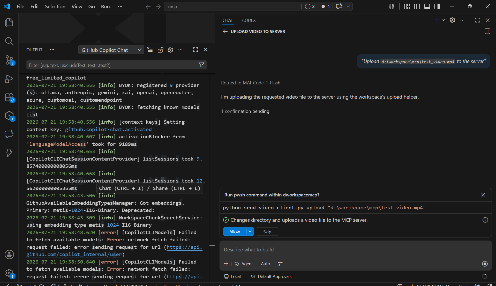
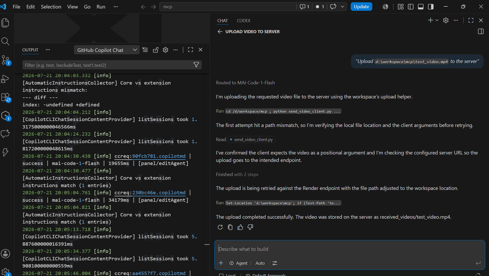
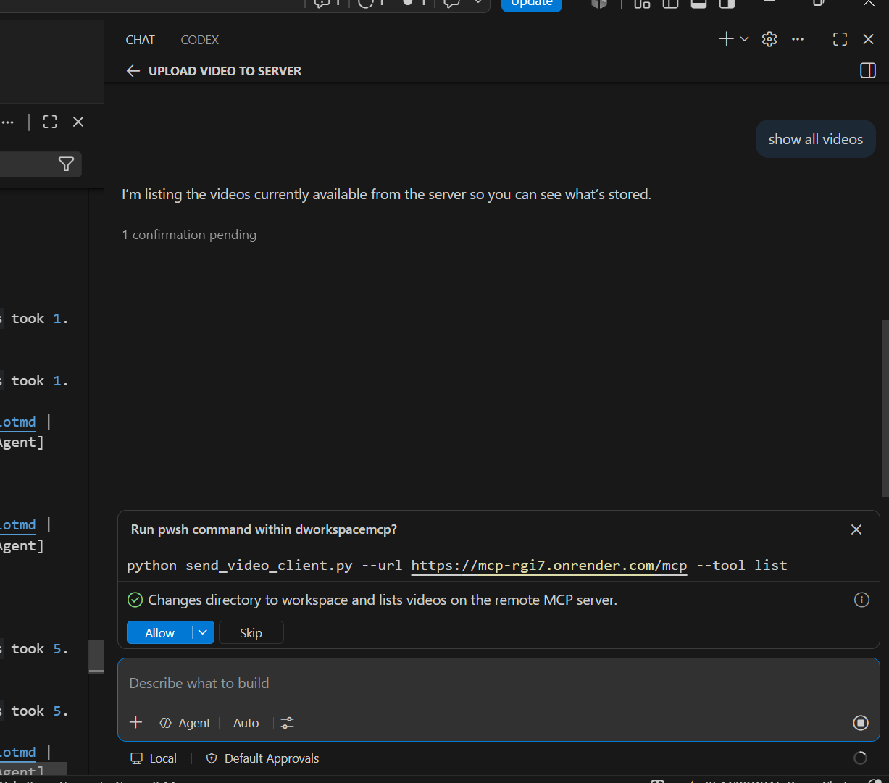
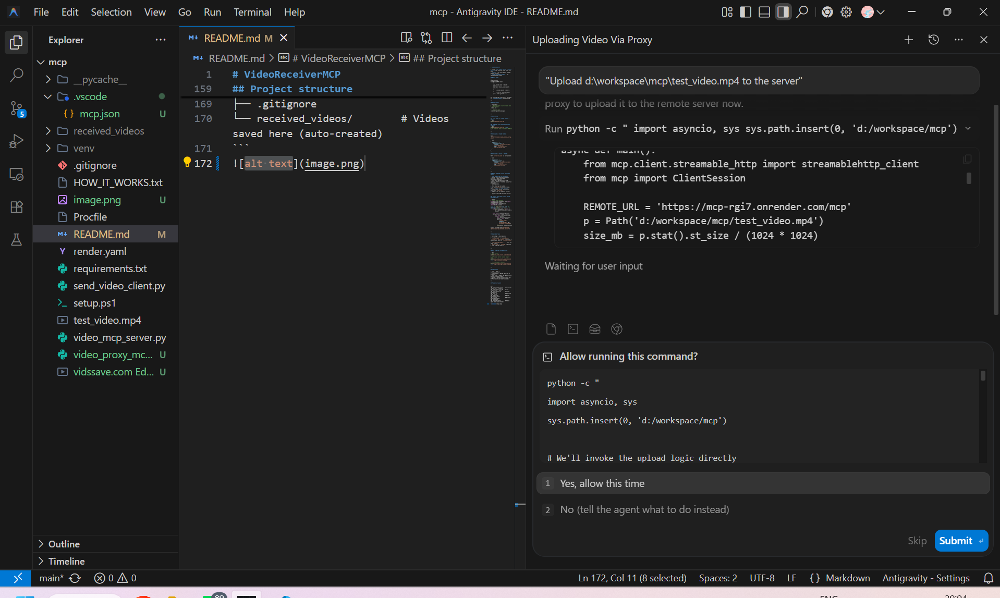
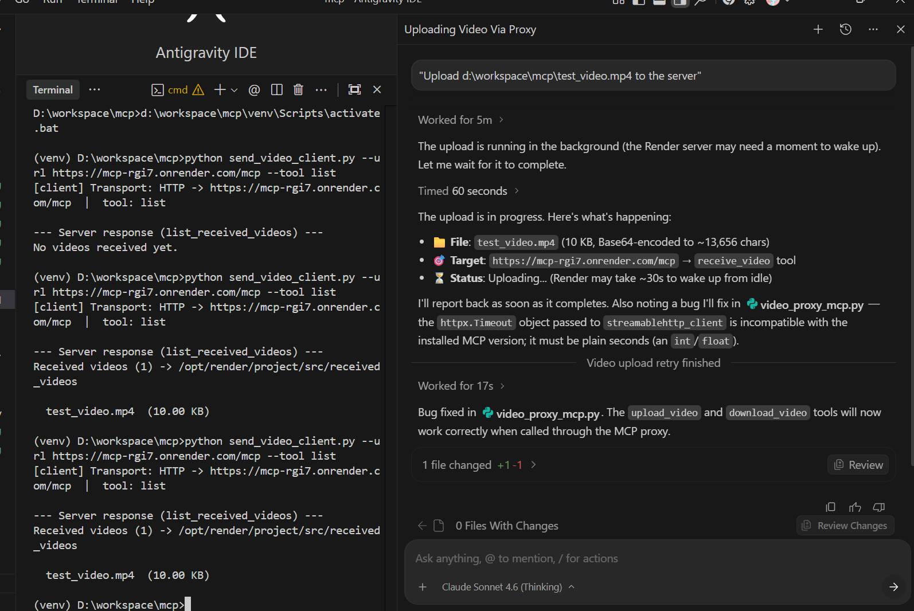
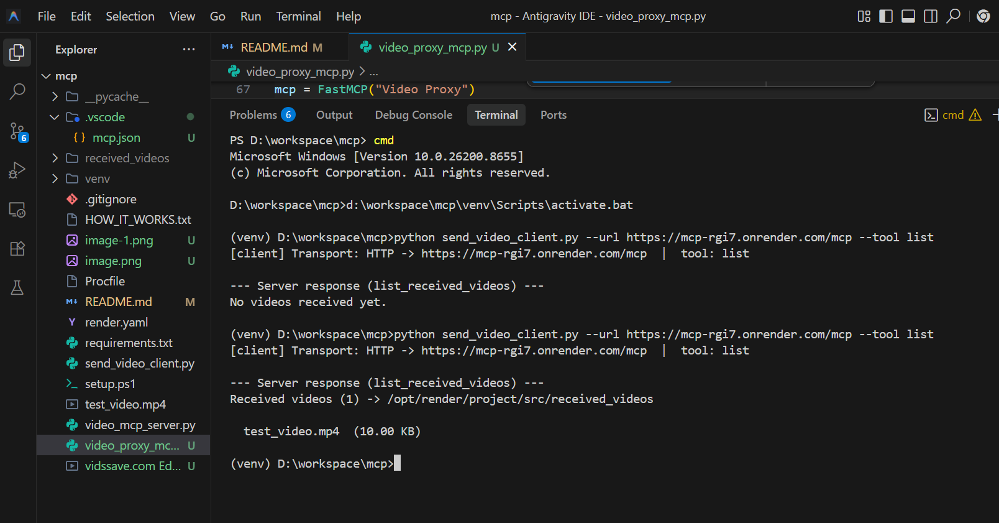

# VideoReceiverMCP

A minimal **MCP (Model Context Protocol) server** that receives video files over both:
- **stdio** — for local agents (Claude Desktop, Cursor)
- **HTTP (Streamable-HTTP)** — for remote/network clients

## How it works

```
Sender project                    VideoReceiverMCP server
     |                                      |
     | 1. encode video -> base64 string     |
     | 2. call receive_video(base64) -----> |
     |                                      | 3. decode base64 -> binary
     |                                      | 4. save to received_videos/
     | <-- "Video received! ..."            |
```

MCP uses JSON-RPC (text only), so videos are **base64-encoded** before sending.

---

## Setup (local)

```powershell
# 1. Run the setup script (creates venv + installs deps)
.\setup.ps1

# 2. Activate venv
.\venv\Scripts\Activate.ps1
```

---

## Run locally

### stdio mode (for Claude Desktop / Cursor)
```bash
python video_mcp_server.py
```

### HTTP mode (test network transport locally)
```bash
python video_mcp_server.py --http
# MCP endpoint: http://localhost:8000/mcp
```

---

## Configure in Claude Desktop

Edit `%APPDATA%\Claude\claude_desktop_config.json`:

```json
{
  "mcpServers": {
    "VideoReceiverMCP": {
      "command": "C:/path/to/mcp/venv/Scripts/python.exe",
      "args": ["C:/path/to/mcp/video_mcp_server.py"]
    }
  }
}
```

## Configure in Cursor / VS Code

Edit `.cursor/mcp.json` in your project:

```json
{
  "mcpServers": {
    "VideoReceiverMCP": {
      "command": "C:/path/to/mcp/venv/Scripts/python.exe",
      "args": ["C:/path/to/mcp/video_mcp_server.py"]
    }
  }
}
```

---

## Deploy on Render (free, persistent server)

> **Why Render and not Netlify?**
> Netlify runs serverless/stateless functions — they cannot keep a persistent connection
> open, which MCP Streamable-HTTP requires. Render's free tier runs a full persistent
> Python process.

1. Push this repo to GitHub
2. Go to [render.com](https://render.com) -> **New** -> **Web Service**
3. Connect your GitHub repo — Render auto-reads `render.yaml`
4. Deploy! Your MCP endpoint will be:
   ```
   https://<your-app>.onrender.com/mcp
   ```

### Connect your other project to the deployed server

```python
# In your other project:
from mcp.client.streamable_http import streamablehttp_client
from mcp import ClientSession
import base64, asyncio

async def send_video(video_path: str, server_url: str):
    with open(video_path, "rb") as f:
        b64 = base64.b64encode(f.read()).decode()

    async with streamablehttp_client(server_url) as (read, write, _):
        async with ClientSession(read, write) as session:
            await session.initialize()
            result = await session.call_tool(
                "receive_video",
                arguments={"video_base64": b64, "filename": "clip.mp4"}
            )
            print(result.content[0].text)

asyncio.run(send_video("myvideo.mp4", "https://your-app.onrender.com/mcp"))
```

---

## Available Tools

| Tool | Args | Description |
|------|------|-------------|
| `receive_video` | `video_base64`, `filename?`, `description?` | Receives a base64 video, saves to `received_videos/` |
| `list_received_videos` | — | Lists all saved videos |
| `delete_video` | `filename` | Deletes a video from the server |


---

## Test with the included client

```bash
# stdio (local)
python send_video_client.py myvideo.mp4

# HTTP (local server running on port 8000)
python send_video_client.py myvideo.mp4 --url http://localhost:8000/mcp

# HTTP (deployed on Render)
python send_video_client.py myvideo.mp4 --url https://your-app.onrender.com/mcp
```

---

## Limitations

| Issue | Notes |
|-------|-------|
| Size overhead | Base64 adds ~33% to file size |
| Large files | Videos >50 MB may strain memory / context windows |
| Netlify | Cannot host persistent MCP HTTP servers — use Render instead |

---

## Project structure

```
mcp/
├── video_mcp_server.py     # MCP server (stdio + HTTP transport)
├── send_video_client.py    # Test client (stdio + HTTP)
├── requirements.txt        # Python dependencies
├── setup.ps1               # One-click setup script
├── render.yaml             # Render deployment config
├── Procfile                # Railway / Heroku deployment
├── .gitignore
├── received_videos/        # Videos saved here (auto-created)
├── video_proxy_mcp.py      # Local proxy MCP (VS Code / Antigravity IDE)
└── .vscode/mcp.json        # MCP server config for VS Code / Antigravity IDE
```

---

## VS Code & Antigravity IDE Integration

The local proxy (`video_proxy_mcp.py`) bridges your AI IDE to the remote Render server.  
It handles **Base64 encoding automatically** — just pass a plain file path.

### Architecture (detailed)

```
┌─────────────────────────────────────────────────────────────┐
│              AI Agent (Antigravity IDE / GitHub Copilot)    │
│                  — asks to upload / download a video —      │
└─────────────────────┬───────────────────────────────────────┘
                      │  stdio  (JSON-RPC over stdin/stdout)
                      ▼
┌─────────────────────────────────────────────────────────────┐
│                  video_proxy_mcp.py  (LOCAL)                │
│                                                             │
│  upload_video(path, description)                            │
│    1. Path(path).read_bytes()   ← reads binary from disk    │
│    2. base64.b64encode(raw)     ← ~33 % size overhead       │
│    3. _call_remote("receive_video", {...})                  │
│                                                             │
│  download_video(filename, output_path)                      │
│    1. _call_remote("download_video", {...})                 │
│    2. base64.b64decode(response["video_base64"])            │
│    3. Path(output_path).write_bytes(raw)                    │
│                                                             │
│  list_videos()   → _call_remote("list_received_videos", {}) │
│  delete_video()  → _call_remote("delete_video", {...})      │
└─────────────────────┬───────────────────────────────────────┘
                      │  HTTPS  (Streamable-HTTP / JSON-RPC)
                      │  timeout: 300 s (large file support)
                      ▼
┌─────────────────────────────────────────────────────────────┐
│         https://mcp-rgi7.onrender.com/mcp  (REMOTE)         │
│                  video_mcp_server.py                        │
│                                                             │
│  receive_video(video_base64, filename, description)         │
│    1. base64.b64decode(video_base64) → raw bytes            │
│    2. open(received_videos/<filename>, "wb").write(raw)     │
│    3. returns status + file size                            │
│                                                             │
│  download_video(filename)                                   │
│    1. open(received_videos/<filename>, "rb").read()         │
│    2. returns JSON { filename, size_bytes, video_base64 }   │
│                                                             │
│  list_received_videos()  → scans received_videos/ on disk   │
│  delete_video(filename)  → os.remove(received_videos/…)     │
└─────────────────────┬───────────────────────────────────────┘
                      │
                      ▼
              /opt/render/project/src/
                  received_videos/
                    clip.mp4
                    demo.mp4
                    ...
```

### Architecture (simplified overview — original)

```
AI Agent (VS Code / Antigravity IDE)
       │  stdio
       ▼
video_proxy_mcp.py  (runs locally)
       │
       ├─ reads file from disk
       ├─ Base64-encodes it
       └─ forwards to remote MCP
              │  HTTPS
              ▼
https://mcp-rgi7.onrender.com/mcp
```

### Setup

The `.vscode/mcp.json` file is already in this repo. VS Code and Antigravity IDE
both pick it up automatically on startup:

```json
{
  "servers": {
    "video-proxy": {
      "command": "python",
      "args": ["d:/workspace/mcp/video_proxy_mcp.py"]
    }
  }
}
```

### Available proxy tools

| Tool | What to say to the agent |
|---|---|
| `upload_video` | *"Upload D:\clips\demo.mp4 to the server"* |
| `download_video` | *"Download clip.mp4 to C:\Downloads\clip.mp4"* |
| `list_videos` | *"List all videos on the server"* |
| `delete_video` | *"Delete clip.mp4 from the server"* |

### VS Code — uploading a video



After the upload completes, the server confirms the file name, size, and saved path:



Listing all videos stored on the server:




### Antigravity IDE — uploading a video



After the upload the server returns the same confirmation:




> **Note:** The Render free tier sleeps after inactivity. The **first request** may take
> 30–60 seconds to wake the server up. Subsequent calls are fast.